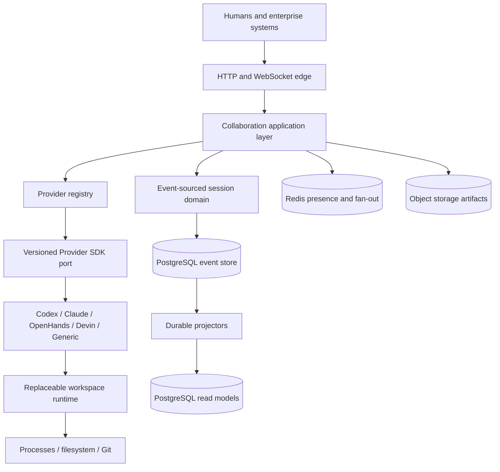

# Architecture

Parallel is an event-sourced collaboration runtime around exactly one provider execution per session branch.

## Invariants

- One branch has at most one active execution and exactly zero or one driver.
- Driver changes use optimistic concurrency and are atomic with their emitted event.
- Comments are collaboration metadata and never enter provider input.
- Steering reaches a provider only after approval by the current driver.
- Emergency pause bypasses the proposal flow and immediately calls provider interruption.
- Every accepted command and provider observation is appended before it is broadcast.
- Reconnect and late join rebuild from a snapshot plus immutable events, never from Redis.
- Artifacts are session-owned and content-addressed; user identity is attribution only.
- Forks share history by reference through a parent checkpoint and diverge into a new stream.

## Documents

- [ADR 0001: modular monolith](decisions/0001-modular-monolith.md)
- [ADR 0002: event sourcing](decisions/0002-event-sourcing.md)
- [ADR 0003: realtime delivery](decisions/0003-realtime-delivery.md)
- [ADR 0004: development identity boundary](decisions/0004-development-identity-boundary.md)
- [ADR 0005: at-least-once outbox](decisions/0005-at-least-once-outbox.md)
- [ADR 0006: workspace execution backend](decisions/0006-workspace-execution-backend.md)
- [ADR 0007: commit checkpoints and reference forks](decisions/0007-commit-checkpoints-and-reference-forks.md)
- [ADR 0008: command concurrency during provider streaming](decisions/0008-command-concurrency-during-streaming.md)
- [ADR 0009: Codex as the first real provider](decisions/0009-first-real-provider-codex.md)
- [ADR 0010: versioned provider capabilities](decisions/0010-versioned-provider-capabilities.md)
- [ADR 0011: continuation steering](decisions/0011-continuation-steering.md)
- [ADR 0012: provider process ownership](decisions/0012-provider-process-ownership.md)
- [ADR 0013: trusted local execution](decisions/0013-trusted-local-agent-execution.md)
- [ADR 0014: standalone Provider SDK and isolated registry](decisions/0014-provider-sdk-and-registry.md)
- [Event model](event-model.md)
- [Database model](database.md)
- [Provider protocol](provider-protocol.md)
- [Provider lifecycle](provider-lifecycle.md)
- [Capability negotiation](capability-negotiation.md)
- [Real provider architecture](real-provider.md)
- [Provider certification](provider-certification.md)
- [Workspace runtime](workspace-runtime.md)
- [Collaborative execution loop](collaborative-loop.md)
- [API](../api.md)
- [Adding a provider](../providers/adding-a-provider.md)
- [Provider compatibility](../providers/compatibility.md)
