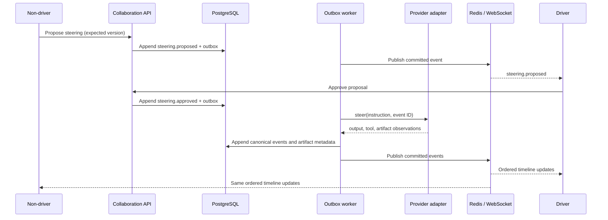

# Collaborative execution loop

The outbox event ID is the provider command idempotency key. Provider
observations carry a provider execution ID, observation ID, and monotonic
sequence. Parallel rejects gaps. Canonical event identity is recoverable from
the observation causation ID, so a failure between event append and projection
retries the same projection without duplicating the event. The provider cursor
and durable inbox advance only after projections succeed.

Clients maintain their last durable sequence. A gap or reconnect triggers
`GET /events?after=<sequence>`; Redis and WebSockets are never recovery sources.
