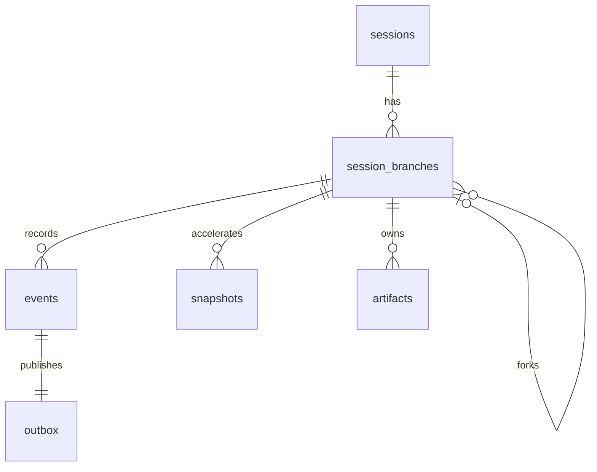

# Database model

PostgreSQL owns authoritative state.

Core tables:

- `sessions`: tenant boundary, lifecycle metadata, owning organization.
- `session_branches`: stream head, provider binding, parent branch and checkpoint.
- `events`: append-only envelope, unique `(stream_id, sequence)`.
- `outbox`: transactional publication state.
- `snapshots`: replaceable aggregate snapshots.
- `artifacts`: session-owned metadata, content hash, storage locator, provenance.
- `idempotency_keys`: command response replay and conflict protection.
- `users`, `organizations`, `organization_memberships`: internal identity and authorization boundary.
- `sessions`, `session_branches`: organization ownership and provider binding.
- `provider_executions`, `provider_observation_inbox`: provider lifecycle, cursor, ordering, and deduplication.
- `consumer_inbox`: durable consumer idempotency.
- `artifacts`: session-owned, content-addressed provider outputs.

Read models are rebuilt from events and optimized separately for active sessions, timelines, participant history, artifact browsing, and audit export.
