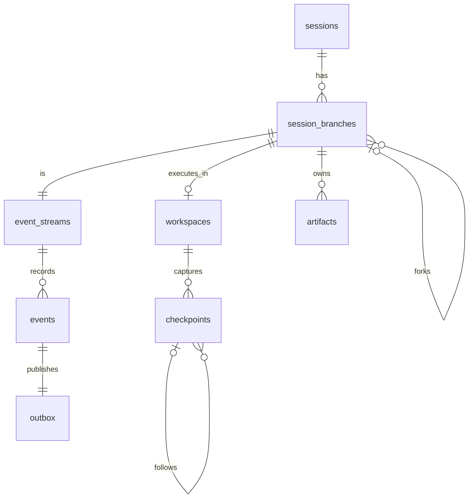

# Database model

PostgreSQL owns authoritative state.

Core tables:

- `sessions`: tenant boundary, lifecycle metadata, owning organization.
- `event_streams`: gap-free optimistic stream head.
- `session_branches`: provider binding plus parent branch and checkpoint reference.
- `events`: append-only envelope, unique `(stream_id, sequence)`.
- `outbox`: transactional publication state.
- `workspaces`: stable branch-to-runtime identity, repository metadata, fork ancestry.
- `checkpoints`: Git commit identity, checkpoint parent, summary, restore audit time.
- `artifacts`: session/workspace ownership, media type, version, content hash, inline
  development content, and creating event.
- `idempotency_keys`: command response replay and conflict protection.
- `users`, `organizations`, `organization_memberships`: internal identity and authorization boundary.
- `provider_executions`, `provider_observation_inbox`: provider lifecycle, cursor, ordering, and deduplication.
- `consumer_inbox`: durable consumer idempotency.
The event log is authoritative. Workspace, checkpoint, provider execution, and
artifact rows are rebuildable projections or durable content indexes. Artifact
content will move from inline PostgreSQL storage to object storage without
changing event or provider contracts.
