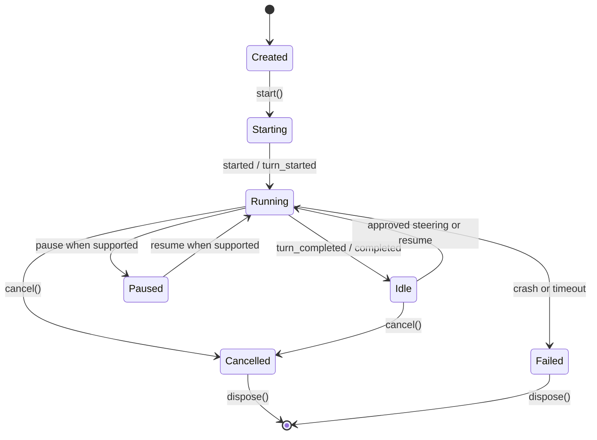

# Provider lifecycle

Every adapter implements the same lifecycle around one branch-bound execution.
Provider-specific processes, sessions, message cursors, and APIs remain private
to the adapter.

`createExecution` is idempotent for a branch and returns a stable execution
identity. `start` binds the upstream provider to the requested workspace and
begins the observation stream. A provider may emit multiple turns but Parallel
still owns one logical execution.

Only approved steering reaches `steer`. Interactive providers deliver it to the
active session; continuation providers queue it and emit delivery when the next
turn starts. Comments never invoke this method.

`pause`, `resume`, `cancel`, `checkpoint`, and `restore` are called only when
declared. Cancellation is idempotent and terminal. `dispose` releases local
resources without deleting durable history or artifacts.

All observations are immutable facts with stable identity and contiguous local
sequence. The orchestrator persists each normalized fact before live fan-out.
Reconnect and late join read the committed event stream; provider callbacks are
never the replay source of truth.

Cursor-based providers emit `cursor` only after every preceding observation in
the batch. Parallel commits `provider.cursor_advanced` and projects the cursor
onto the execution row. Recovery starts from that committed cursor. If a crash
occurs between an observation and its cursor, stable upstream identities make
the replay idempotent while still advancing the local sequence high-water mark.

Recovery passes an opaque provider session ID, the next observation sequence,
and a generic state (`paused`, `idle`, or `interrupted`). Adapters may reattach,
cursor-replay, continue from workspace state, or truthfully declare no recovery.
