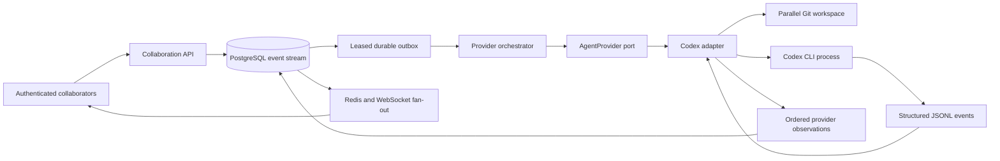

# Real provider architecture

## Package boundary

`@parallel/provider-sdk` defines the versioned capability contract, metadata,
readiness result, lifecycle operations, steering receipts, and ordered
observations. `@parallel/codex-provider` alone owns Codex flags, process
environment, JSON parsing, thread IDs, continuation invocation, exit
classification, redaction, and size limits. The session aggregate knows only
approved steering and canonical events.

One branch maps to one logical provider execution ID and one Parallel workspace.
Codex turns reuse one provider thread until a workspace fork starts a new
provider execution. A Git fork clones committed workspace state and inherits
Parallel history by checkpoint reference; hidden model or provider state is not
cloned.

## Lifecycle normalization

1. The outbox delivers `execution.requested`.
2. Parallel creates or forks the workspace and records
   `provider.execution_starting`.
3. The adapter starts Codex and records the process and stable thread identity.
4. Agent messages, exposed reasoning summaries, command/file tools, usage, and
   warnings become ordered observations. Hidden chain-of-thought is neither
   requested nor reconstructed.
5. Git status and diff are inspected at a turn boundary. Concise diffs remain in
   events; larger patches and final reports become versioned session artifacts.
6. A queued instruction resumes the same thread. Otherwise the provider becomes
   idle and awaits later steering.
7. Pause or cancellation terminates the process group. Timeout and unexpected
   non-zero exits have distinct canonical lifecycle events.

Codex command results expose aggregated tool output, not a trustworthy split
between stdout and stderr. Parallel records that result as a shell tool and
terminal command result without fabricating stream attribution. Codex process
stderr is a redacted provider warning.

## Credentials and failure behavior

The API host's standard Codex login is used only by the child process.
Credentials are not returned by readiness, written to events, stored in the
database, or copied into artifacts. Readiness performs bounded version and login
status probes and returns sanitized diagnostics.

Committed observations survive browser and API reconnects. An active process
cannot currently be reattached after its owning host dies. Startup reconciliation
marks it crashed and preserves the Codex thread ID so later continuation remains
possible where Codex persisted the conversation.
