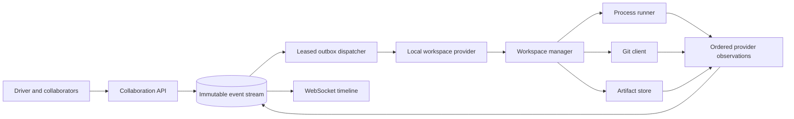

# Workspace runtime

## Lifecycle

One session branch maps to one stable workspace ID and repository directory.
Creation either clones a requested ref without shared hardlinks or initializes
a repository with a real initial commit. Metadata is persisted beside the
workspace so an adapter can recover after an API process restart.

Commands use `spawn` with an executable and argument vector, a workspace
working directory, controlled `HOME`, a sanitized environment, no implicit
shell, and a cancellable process group. Output chunks are observations as they
arrive. Completion triggers real `git status` and binary-capable Git diff
collection. File events distinguish created, modified, deleted, and renamed
paths.

Provider operations are serialized per workspace, but dispatch acknowledgements
are non-blocking. That lets the outbox process an emergency pause while a
command is still running. Pause sends `SIGTERM` to the process group; runtime
teardown escalates to `SIGKILL` when necessary.

## Checkpoints and forks

A checkpoint stages the complete working tree and creates an actual Git commit.
Metadata records its commit, parent commit, parent checkpoint, branch, clean
state, summary, and timestamp. Restore performs a hard reset plus untracked-file
cleanup.

A fork clones the source repository without hardlinks, creates a new branch at
the selected commit, stores parent workspace/checkpoint references, and starts a
new event stream. Its permissions remain those of the owning session
organization. Replay inherits parent events and artifacts only through the
selected checkpoint.

## Replaceability and security

`WorkspaceManager` is the local implementation of a runtime boundary. Future
container and microVM implementations must preserve lifecycle, command,
filesystem, Git, checkpoint, fork, and artifact semantics. A local directory
does not isolate syscalls, network, host credentials, CPU, or memory; it must
never execute untrusted production code.
